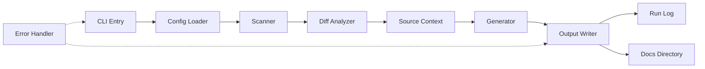

# System Architecture — docgen-template

**Last Updated:** 2026-03-09

## 1. Tech Stack

| Layer | Technology | Version | Purpose |
| :--- | :--- | :--- | :--- |
| **Runtime** | Node.js | LTS | Execution environment for documentation generation |
| **Language** | TypeScript | 5.x | Static typing and modularity for `docgen/` core |
| **Dependency Mgmt** | DEPS.yaml | N/A | External dependency declarations (non-NPM) |
| **Build Tool** | TypeScript Compiler | N/A | Transpilation of `docgen/` source to JS |
| **CLI** | Bash | Standard | Bootstrapping and repository initialization |
| **Output Format** | Markdown | CommonMark | Generated documentation standard |
| **Version Control** | Git | N/A | Source control and diff analysis |

## 2. Architecture Patterns

The system follows a **CLI Tool** architecture with a **Pipeline** processing model.

*   **Scanner-Generator Pattern:** The system separates the analysis of source code (Scanner) from the creation of documentation (Generator).
*   **Dependency Injection:** Core modules (`scanner`, `diff-analyzer`, `source-context`) are decoupled to allow swapping implementations or mocking for testing.
*   **Template-Based Generation:** Documentation output is structured via templates populated with scanned data.
*   **Immutable Configuration:** Configuration is loaded at startup and treated as immutable during the generation run to ensure reproducibility.

## 3. System Components

### 3.1 Core Engine (`docgen/index.ts`)
*   **Responsibility:** Orchestrates the generation pipeline, manages CLI arguments, and handles error reporting.
*   **Technology:** TypeScript
*   **Key Interfaces:** `generateDocs()`, `runPipeline()`

### 3.2 Scanner (`docgen/scanner.ts`)
*   **Responsibility:** Traverses the repository file tree, identifies source files, and extracts metadata (file paths, extensions, sizes).
*   **Technology:** Node.js `fs` module, TypeScript
*   **Key Interfaces:** `scanDirectory()`, `getFileTree()`

### 3.3 Diff Analyzer (`docgen/diff-analyzer.ts`)
*   **Responsibility:** Compares current state against previous commits to identify changed files and determine documentation scope.
*   **Technology:** Git utilities, TypeScript
*   **Key Interfaces:** `getChangedFiles()`, `analyzeDiff()`

### 3.4 Source Context (`docgen/source-context.ts`)
*   **Responsibility:** Aggregates file contents and metadata into a structured context object for the generator.
*   **Technology:** TypeScript
*   **Key Interfaces:** `buildContext()`, `loadFileContent()`

### 3.5 Output Writer (`docgen/index.ts` / `scripts/`)
*   **Responsibility:** Writes generated Markdown files to the `docs/` directory and updates the `run-log.jsonl`.
*   **Technology:** Node.js `fs` module, Bash
*   **Key Interfaces:** `writeDocs()`, `updateLog()`

## 4. Component Relationships

The system operates as a linear pipeline with feedback loops for error handling.

*   **CLI** initializes the **Config** loader.
*   **Scanner** feeds raw file data to the **Diff Analyzer**.
*   **Diff Analyzer** determines scope for the **Source Context**.
*   **Source Context** provides data to the **Generator**.
*   **Generator** produces Markdown content for the **Output Writer**.
*   **Output Writer** persists files and logs execution status.

## 5. Data Flow

1.  **Input:** Repository root directory and Git history.
2.  **Scanning:** `scanner.ts` reads the directory structure recursively.
3.  **Analysis:** `diff-analyzer.ts` compares current HEAD against previous commits (if available) to identify changes.
4.  **Context Building:** `source-context.ts` aggregates relevant file contents into a JSON structure.
5.  **Generation:** Templates are applied to the context to produce Markdown files.
6.  **Output:** Files are written to `docs/` and execution metadata is appended to `docgen/.run-log.jsonl`.
7.  **Cleanup:** Temporary files are removed; errors are logged.

## 6. Infrastructure

*   **Hosting:** Local execution or CI/CD Pipeline (GitHub Actions, GitLab CI, or similar).
*   **Storage:** Local filesystem for source code and generated documentation.
*   **Execution Environment:** Node.js runtime (compatible with LTS versions).
*   **Logging:** JSONL format (`docgen/.run-log.jsonl`) for audit trails.
*   **Bootstrap:** Shell scripts (`bootstrap-repo.sh`, `bootstrap-all.sh`) handle environment setup and dependency installation.

## 7. Design Decisions

| Decision | Rationale | Trade-off |
| :--- | :--- | :--- |
| **TypeScript Core** | Ensures type safety and maintainability for complex parsing logic. | Slightly higher build time compared to pure JS. |
| **Modular Scanning** | Allows independent updates to scanning logic without breaking generation. | Increased coupling via shared context interfaces. |
| **JSONL Logging** | Enables easy parsing of execution history for debugging and auditing. | Requires specific tooling to read logs effectively. |
| **Git-Based Diffing** | Reduces unnecessary regeneration by only processing changed files. | Requires Git history to be available locally. |
| **Bash Bootstrapping** | Provides a simple, universal entry point for environment setup. | Less portable than a pure Node.js bootstrap script. |
| **Markdown Output** | Universal compatibility with documentation platforms (GitHub, GitLab, etc.). | Limited formatting capabilities compared to HTML/DOCX. |